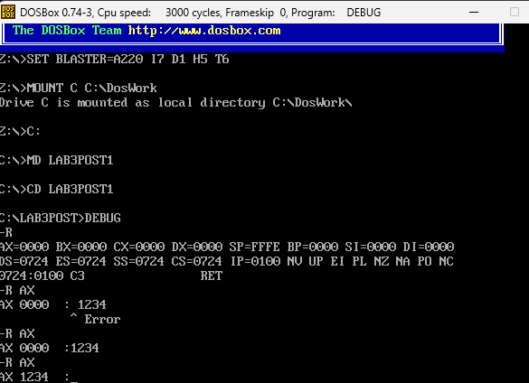
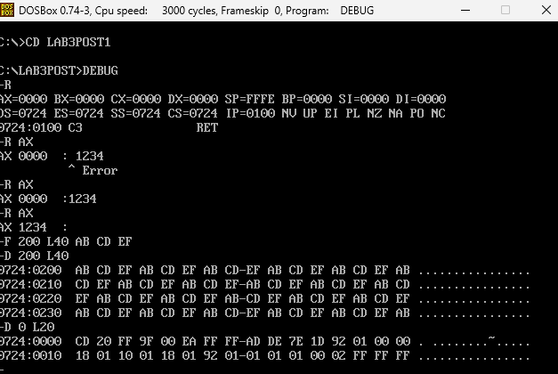
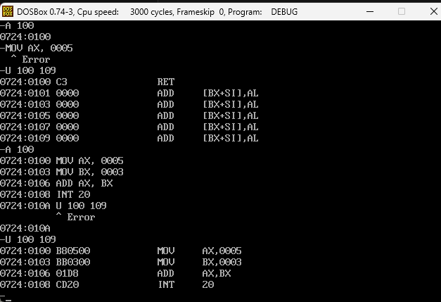
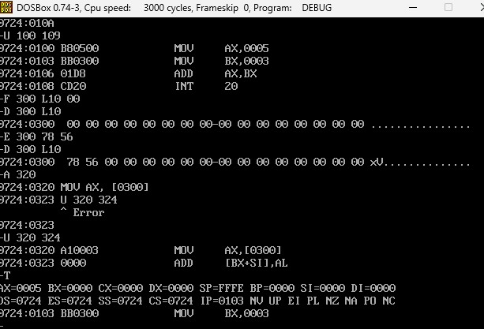

# Gaona-post1-u3

## Descripción

Este repositorio contiene el post-contenido de la Unidad 3: un laboratorio guiado de dos partes ejecutado directamente en DOSBox con el depurador DEBUG.

La **Parte 1** explora el entorno DEBUG: inspección de registros con `R`, relleno y volcado de memoria con `F` y `D`, desensamblado con `U`, modificación puntual de memoria con `E`, y direccionamiento directo a memoria.

La **Parte 2** ensambla programas propios con el comando `A`, los ejecuta instrucción a instrucción con `T` registrando la evolución en tablas de traza, y analiza el mecanismo de bucle `LOOP` comparándolo con una implementación equivalente usando `DEC` y `JNZ`, además del comando `G` como alternativa de verificación rápida.

Ambas partes se documentan con capturas de pantalla y las decisiones técnicas justificadas correspondientes.

## Parte 2 — Checkpoint 1: Traza del programa de suma

| Instrucción ejecutada | AX | BX | CX | IP siguiente | ZF | CF | SF |
|---|---|---|---|---|---|---|---|
| MOV AX,000A | 000A | 0000 | 0000 | 0103 | 0 (NZ) | 0 (NC) | 0 (PL) |
| MOV BX,0005 | 000A | 0005 | 0000 | 0106 | 0 (NZ) | 0 (NC) | 0 (PL) |
| MOV CX,0003 | 000A | 0005 | 0003 | 0109 | 0 (NZ) | 0 (NC) | 0 (PL) |
| ADD AX,BX | 000F | 0005 | 0003 | 010B | 0 (NZ) | 0 (NC) | 0 (PL) |
| ADD AX,CX | 0012 | 0005 | 0003 | 010D | 0 (NZ) | 0 (NC) | 0 (PL) |

**Verificación:** AX = 0x0012 (18 decimal) al finalizar las instrucciones ADD. 

## Parte 2 — Checkpoint 2: Traza del bucle con LOOP

| Iteración | Instrucción | AX después | CX después | IP siguiente | ¿LOOP salta? |
|---|---|---|---|---|---|
| — | MOV AX,0000 | 0000 | (sin cambiar) | 0103 | — |
| — | MOV CX,0004 | 0000 | 0004 | 0106 | — |
| 1 | ADD AX,+02 | 0002 | 0004 | 0109 | — |
| 1 | LOOP 0106 | 0002 | 0003 | 0106 | Sí |
| 2 | ADD AX,+02 | 0004 | 0003 | 0109 | — |
| 2 | LOOP 0106 | 0004 | 0002 | 0106 | Sí |
| 3 | ADD AX,+02 | 0006 | 0002 | 0109 | — |
| 3 | LOOP 0106 | 0006 | 0001 | 0106 | Sí |
| 4 | ADD AX,+02 | 0008 | 0001 | 0109 | — |
| 4 | LOOP 0106 | 0008 | 0000 | 010B | No |
| — | INT 20 | 0008 | 0000 | — | (programa termina) |

**Verificación:** AX = 0x0008 (8 decimal) cuando LOOP finalmente no salta (CX = 0x0000). 

## Parte 1 — Exploración con DEBUG en DOSBox

### Checkpoint 1: Estado de registros

Se ejecutó el comando `R` sin argumentos para examinar el estado inicial del procesador, confirmando que los registros de propósito general (AX, BX, CX, DX) están en cero, SP apunta al tope inicial de la pila, los registros de segmento comparten el mismo valor (el segmento del PSP asignado por DOS), e IP está en 0x0100. Luego se modificó AX a 0x1234 con `R AX`, confirmando que la modificación es selectiva y no afecta el resto del estado del procesador.

### Checkpoint 2: Volcado hexadecimal anotado

Se rellenaron 64 bytes a partir de DS:0200 con el patrón `AB CD EF` usando `F 200 L40 AB CD EF`, y se confirmó con `D 200 L40` que el patrón se repite cíclicamente en las 4 filas del volcado.

**¿Qué representa cada columna de la salida de `D`?** La primera columna muestra la dirección de memoria (segmento:offset) donde comienza cada fila del volcado. Las siguientes 16 columnas muestran los bytes de esa región en formato hexadecimal, separados por un guion a la mitad para facilitar la lectura visual de los primeros 8 y los últimos 8 bytes. La columna final, a la derecha, muestra la representación ASCII de esos mismos 16 bytes: cada byte se traduce a su carácter imprimible correspondiente (0x20–0x7E), y se muestra un punto (`.`) cuando el valor no corresponde a ningún carácter imprimible, como ocurre con los valores AB, CD y EF de este relleno.

### Checkpoint 3: Ensamblado y desensamblado

Se ensambló con `A 100` un programa de 4 instrucciones (`MOV AX,0005`, `MOV BX,0003`, `ADD AX,BX`, `INT 20`) y se verificó con `U 100 109` la correspondencia exacta entre mnemónicos y bytes de código máquina: `B8 05 00`, `BB 03 00`, `03 C3` y `CD 20` respectivamente, confirmando un programa de 10 bytes en total.

### Checkpoint 4: Modificación de memoria y direccionamiento directo

Se limpió una región de 16 bytes en DS:0300 con `F 300 L10 00`, se verificó con `D`, y se modificaron puntualmente los dos primeros bytes con `E 300 78 56`. Un segundo `D` confirmó que solo esos dos bytes cambiaron, dejando el resto en 0x00. Luego se ensambló en 0x0320 la instrucción `MOV AX,[0300]`, verificada con `U` como `A1 00 03`, y se ejecutó con `T`, confirmando que AX pasó a valer 0x5678.

### Decisión Técnica — Verificación No Destructiva de una Escritura en Memoria

De los cuatro comandos disponibles en este punto (R, E, F y D), el comando correcto para verificar la escritura del Paso 11 es D. Invocar E 300 sin la lista de bytes activa el modo interactivo de DEBUG: el programa muestra el valor actual de cada byte, uno por uno, y espera que el usuario presione una tecla o escriba un nuevo valor antes de avanzar al siguiente. Si en ese momento se presiona accidentalmente una tecla que DEBUG interprete como un dígito hexadecimal, el byte original se sobrescribe sin darse cuenta, contaminando justo la región que se quería confirmar. Esto convierte a E interactivo en un comando potencialmente destructivo, no en una herramienta de solo lectura. El comando F, por su parte, tampoco sirve para verificar porque su propósito es exactamente el opuesto: rellena un rango completo con un patrón de bytes, sobrescribiendo cualquier contenido previo; usarlo "para revisar" borraría la escritura que se busca confirmar. En cambio, D únicamente lee y muestra el contenido de memoria en formato hexadecimal y ASCII, sin modificar ni un solo byte del rango consultado. Esa propiedad —no alterar el estado del programa bajo ninguna circunstancia— es la que garantiza que D sea el único de los cuatro comandos verdaderamente de solo lectura, y por eso es la herramienta correcta cuando el objetivo es confirmar un resultado sin arriesgar el estado que se acaba de construir.

### Decisión Técnica — Modo de Direccionamiento Inmediato vs. Directo a Memoria

Aunque MOV AX,0005 (opcode B8, direccionamiento inmediato) y MOV AX,[0300] (opcode A1, direccionamiento directo a memoria) ocupan exactamente 3 bytes cada una, no requieren el mismo trabajo del procesador durante su ejecución. En el direccionamiento inmediato, el valor que se va a cargar en AX viaja literalmente dentro del flujo de bytes de la instrucción: cuando el procesador realiza el fetch de la instrucción completa, ya tiene el dato listo, sin necesidad de ningún acceso adicional a memoria. En cambio, en el direccionamiento directo a memoria, los bytes de la instrucción no contienen el valor en sí, sino la dirección donde ese valor está almacenado (0x0300 en este caso); esto obliga al procesador a realizar un ciclo extra de acceso al bus de memoria para leer el dato que reside en esa dirección antes de poder colocarlo en AX. Por esta razón, MOV AX,[0300] es más lento que MOV AX,0005 a pesar de tener el mismo tamaño en bytes. El direccionamiento directo a memoria se vuelve preferible, sin embargo, en escenarios donde el valor no es una constante fija conocida al momento de ensamblar, sino un dato que puede cambiar en tiempo de ejecución —como el valor 0x5678 escrito previamente con el comando E en el Paso 11—; en esos casos no existe alternativa al direccionamiento inmediato, porque el programa necesita leer el contenido actual de esa celda de memoria, sea cual sea, en el momento en que se ejecuta. Finalmente, el estudiante puede confirmar con U, sin ejecutar ninguna instrucción, cuál codificación produjo cada comando A: el desensamblado muestra directamente si el operando fuente aparece como un valor inmediato (por ejemplo, MOV AX,0005) o entre corchetes indicando una dirección de memoria (MOV AX,[0300]), y los bytes hexadecimales listados junto a cada instrucción (B8 05 00 frente a A1 00 03) permiten distinguir el opcode y, por tanto, el modo de direccionamiento empleado, todo antes de que el procesador ejecute una sola instrucción.