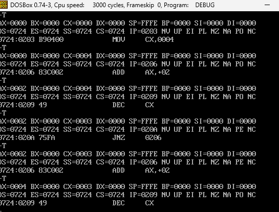
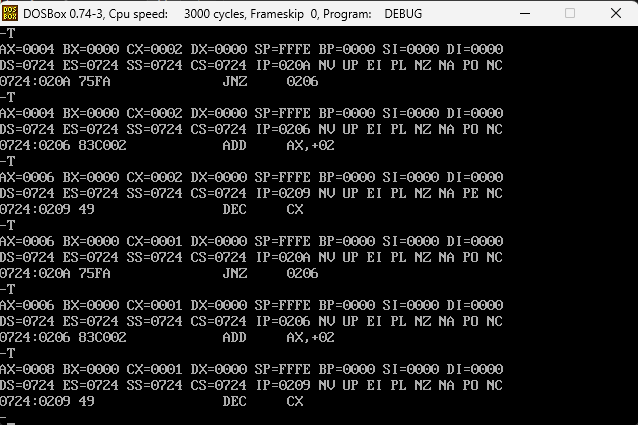
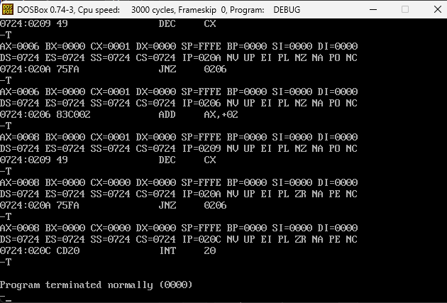

El volcado muestra los bytes que componen el programa del bucle. `MOV AX,0000` y `MOV CX,0004` ocupan 3 bytes cada una (`B8 00 00` y `B9 04 00`); `ADD AX,+02` también ocupa 3 bytes, codificado en esta sesión como `83 C0 02`; `LOOP 0106` ocupa 2 bytes (`E2 FB`); e `INT 20` ocupa 2 bytes (`CD 20`). El total del programa es de 13 bytes para realizar 4 sumas de forma iterativa.

### Decisión Técnica — Selección de Mecanismo de Control de Bucle (LOOP vs. DEC/JNZ)

Comparando la codificación de LOOP 0106 (E2 FB, 2 bytes, Paso 6) con la de DEC CX + JNZ 0206 (49 75 FA, 3 bytes, Paso 9), para un bucle contador simple como este —en el que CX no se necesita para ningún otro propósito dentro del cuerpo del bucle— el mecanismo recomendado es LOOP. La razón es doble: en términos de bytes de código máquina, LOOP ocupa 2 bytes frente a los 3 bytes combinados de DEC + JNZ, lo que representa un ahorro de memoria de programa. Pero la diferencia más relevante está en el número de instrucciones que el procesador debe extraer (fetch) por iteración: LOOP combina el decremento de CX y el salto condicional en una sola instrucción, por lo que el procesador solo necesita un ciclo de fetch por vuelta del bucle; DEC/JNZ, en cambio, son dos instrucciones separadas, lo que obliga a dos fetches independientes en cada iteración. Esto se confirmó directamente en la traza: el bucle con LOOP (Paso 7) requirió 11 invocaciones de T en total, mientras que el bucle equivalente con DEC/JNZ (Paso 11) requirió 15 — exactamente 4 instrucciones adicionales, una por cada una de las 4 iteraciones.

Sin embargo, existe al menos un escenario concreto donde DEC/JNZ sería preferible a pesar de ocupar más bytes: cuando el cuerpo del bucle necesita reutilizar el registro CX para otra operación aritmética distinta al conteo. Como LOOP depende exclusivamente de CX como contador implícito, cualquier instrucción dentro del bucle que modifique CX para otro fin rompería la lógica del conteo de iteraciones. DEC/JNZ, en cambio, permite usar cualquier registro como contador (por ejemplo DEC BX + JNZ), liberando a CX para otros usos. Lo mismo aplica si la condición de salida del bucle no es simplemente "CX ≠ 0", sino el resultado de una comparación evaluada con CMP: en ese caso JNZ (o cualquier otro salto condicional) puede usarse después de un CMP, mientras que LOOP está atado únicamente al decremento de CX y no admite otra condición de salida.

Finalmente, el estudiante puede verificar con el comando U, sin ejecutar ninguna instrucción, cuál de las dos versiones ocupa menos bytes de código máquina: el desensamblado muestra directamente, junto a cada dirección, los bytes hexadecimales de cada instrucción, permitiendo sumar y comparar el total ocupado por cada versión del bucle (2 bytes para LOOP frente a 3 bytes para DEC+JNZ) antes de ejecutar nada.

### Checkpoint 3: Traza y comparación — Bucle equivalente con DEC/JNZ

| Iteración | Instrucción | AX después | CX después | IP siguiente | ¿JNZ salta? |
|---|---|---|---|---|---|
| — | MOV AX,0000 | 0000 | (sin cambiar) | 0203 | — |
| — | MOV CX,0004 | 0000 | 0004 | 0206 | — |
| 1 | ADD AX,+02 | 0002 | 0004 | 0209 | — |
| 1 | DEC CX | 0002 | 0003 | 020A | — |
| 1 | JNZ 0206 | 0002 | 0003 | 0206 | Sí |
| 2 | ADD AX,+02 | 0004 | 0003 | 0209 | — |
| 2 | DEC CX | 0004 | 0002 | 020A | — |
| 2 | JNZ 0206 | 0004 | 0002 | 0206 | Sí |
| 3 | ADD AX,+02 | 0006 | 0002 | 0209 | — |
| 3 | DEC CX | 0006 | 0001 | 020A | — |
| 3 | JNZ 0206 | 0006 | 0001 | 0206 | Sí |
| 4 | ADD AX,+02 | 0008 | 0001 | 0209 | — |
| 4 | DEC CX | 0008 | 0000 | 020A | — |
| 4 | JNZ 0206 | 0008 | 0000 | 020C | No |
| — | INT 20 | 0008 | 0000 | — | (termina) |

**Comparación de instrucciones ejecutadas:** el bucle con `LOOP` (Checkpoint 2) requirió **11 invocaciones de T** (2 de inicialización + 4 × (ADD + LOOP) + 1 de terminación), mientras que este bucle con `DEC`/`JNZ` requirió **15** (2 de inicialización + 4 × (ADD + DEC + JNZ) + 1 de terminación) — 4 instrucciones adicionales, correspondientes a la instrucción de control extra que `DEC`/`JNZ` necesita frente a `LOOP`.

**Verificación:** AX = 0x0008 (8 decimal) tanto con la traza T como con el resultado de G 20C. 

### Decisión Técnica — Comando de Verificación para Bucles de Muchas Iteraciones (T vs. G)

Para verificar el resultado final de un bucle con 100 iteraciones (CX = 0x0064), G 20C es mucho más práctico que repetir T decenas de veces: con un solo comando, el procesador ejecuta a velocidad completa desde la dirección actual hasta alcanzar el punto de interrupción indicado (0x020C en este caso), sin que el usuario tenga que presionar T manualmente cien o más veces ni esperar a que cada paso se muestre en pantalla. Esto se confirmó directamente en la práctica: tras reiniciar IP a 0x0200 con R IP y ejecutar G 20C, DEBUG mostró de inmediato el estado final del procesador (AX=0008, CX=0000, IP=020C) sin ninguna pantalla intermedia. Sin embargo, esta velocidad tiene un costo: se pierde por completo la información intermedia, es decir, el valor de AX y CX después de cada iteración individual, el momento exacto en que JNZ salta o deja de saltar, y la evolución de las banderas paso a paso — todo lo que sí revelaba la traza completa del Paso 11.

Precisamente por esta razón, en los Pasos 4, 7 y 11 de este laboratorio fue realmente necesario usar T en lugar de G: la tarea en cada uno de esos pasos era completar una tabla de traza instrucción por instrucción (registrando AX, CX, IP y las banderas después de cada paso individual), y esa granularidad de "una instrucción a la vez" es exactamente lo que solo T puede ofrecer. G, al ejecutar de corrido hasta el punto de interrupción, sería incompatible con ese objetivo porque saltaría directamente al resultado final sin mostrar ninguno de los estados intermedios que la tabla necesita documentar.

Tras ejecutar G 20C, el comando que el estudiante usaría para confirmar únicamente el valor final de AX, sin haber observado ningún paso intermedio, es R AX — este muestra el valor actual de ese registro específico sin necesidad de invocar R completo (que mostraría todos los registros) ni de retroceder a ver la traza que nunca se ejecutó.