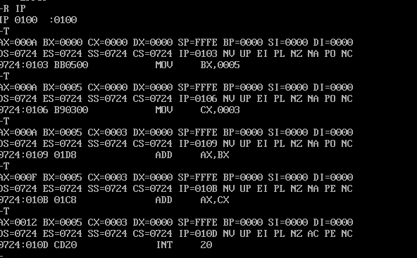

# Gaona-post1-u3

## Descripción

Este repositorio contiene el post-contenido de la Unidad 3: un laboratorio guiado de dos partes ejecutado directamente en DOSBox con el depurador DEBUG.

La **Parte 1** explora el entorno DEBUG: inspección de registros con `R`, relleno y volcado de memoria con `F` y `D`, desensamblado con `U`, modificación puntual de memoria con `E`, y direccionamiento directo a memoria.

La **Parte 2** ensambla programas propios con el comando `A`, los ejecuta instrucción a instrucción con `T` registrando la evolución en tablas de traza, y analiza el mecanismo de bucle `LOOP` comparándolo con una implementación equivalente usando `DEC` y `JNZ`, además del comando `G` como alternativa de verificación rápida.

Ambas partes se documentan con capturas de pantalla y las decisiones técnicas justificadas correspondientes.

## Parte 2 — Checkpoint 1: Traza del programa de suma

| Instrucción ejecutada | AX | BX | CX | IP siguiente | ZF | CF | SF |
|---|---|---|---|---|---|---|---|
| MOV AX,000A | 000A | 0000 | 0000 | 0103 | 0 (NZ) | 0 (NC) | 0 (PL) |
| MOV BX,0005 | 000A | 0005 | 0000 | 0106 | 0 (NZ) | 0 (NC) | 0 (PL) |
| MOV CX,0003 | 000A | 0005 | 0003 | 0109 | 0 (NZ) | 0 (NC) | 0 (PL) |
| ADD AX,BX | 000F | 0005 | 0003 | 010B | 0 (NZ) | 0 (NC) | 0 (PL) |
| ADD AX,CX | 0012 | 0005 | 0003 | 010D | 0 (NZ) | 0 (NC) | 0 (PL) |

**Verificación:** AX = 0x0012 (18 decimal) al finalizar las instrucciones ADD. ✅

## Parte 2 — Checkpoint 2: Traza del bucle con LOOP

| Iteración | Instrucción | AX después | CX después | IP siguiente | ¿LOOP salta? |
|---|---|---|---|---|---|
| — | MOV AX,0000 | 0000 | (sin cambiar) | 0103 | — |
| — | MOV CX,0004 | 0000 | 0004 | 0106 | — |
| 1 | ADD AX,+02 | 0002 | 0004 | 0109 | — |
| 1 | LOOP 0106 | 0002 | 0003 | 0106 | Sí |
| 2 | ADD AX,+02 | 0004 | 0003 | 0109 | — |
| 2 | LOOP 0106 | 0004 | 0002 | 0106 | Sí |
| 3 | ADD AX,+02 | 0006 | 0002 | 0109 | — |
| 3 | LOOP 0106 | 0006 | 0001 | 0106 | Sí |
| 4 | ADD AX,+02 | 0008 | 0001 | 0109 | — |
| 4 | LOOP 0106 | 0008 | 0000 | 010B | No |
| — | INT 20 | 0008 | 0000 | — | (programa termina) |

**Verificación:** AX = 0x0008 (8 decimal) cuando LOOP finalmente no salta (CX = 0x0000). ✅

